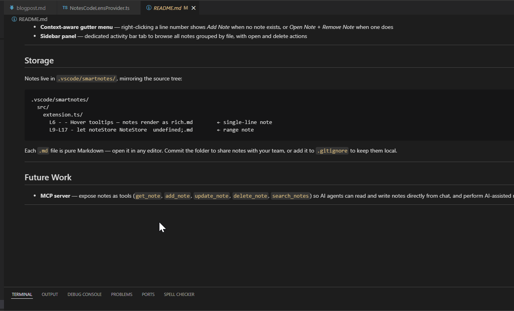
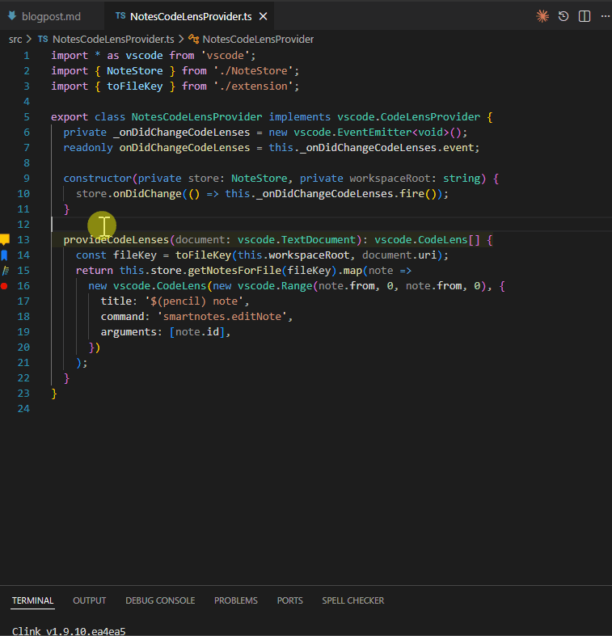
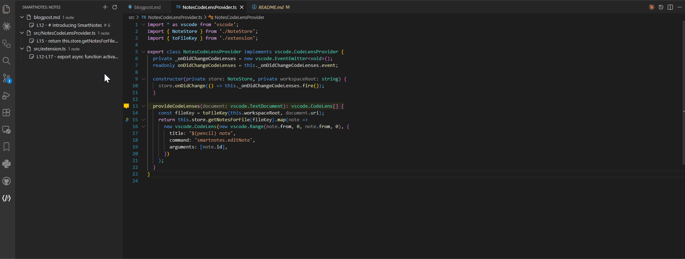

# SmartNotes

Attach persistent Markdown notes to any section of code. Notes render as hover tooltips, stay anchored as code changes, and render images inline.


---

## Features

### Hover tooltips & inline images
Notes render as rich Markdown directly on the annotated line. Local images are inlined as `data:` URIs to bypass VS Code's hover CSP — something no other note extension does.

> *LineNote vs SmartNotes — image rendering in hover*



---

### Position tracking
Notes stay anchored as code changes. Delta tracking keeps them accurate during a live session; on every file open, anchor text is matched against actual file content so notes survive `git pull`, cold restarts, and external edits. Fuzzy matching ignores trailing comments and whitespace changes.

> *LineNote vs Bookmarks vs SmartNotes — position tracking after file changes*



---

### Sidebar panel & gutter menu
Browse all notes grouped by file in a dedicated activity bar panel. Right-click any section to add, open, or remove notes, or use `Ctrl+Alt+N` to add a note from the keyboard.

> *SmartNotes sidebar panel and context-aware gutter menu*




## Storage

Notes live in `.vscode/smartnotes/`, mirroring the source tree:

```
.vscode/smartnotes/
  src/
    extension.ts/
      L6 - - Hover tooltips — notes render as rich.md        ← single-line note
      L9-L17 - let noteStore NoteStore  undefined;.md        ← range note
```

Each `.md` file is pure Markdown — open it in any editor. Commit the folder to share notes with your team, or add it to `.gitignore` to keep them local.


## MCP server 

SmartNotes includes a bundled MCP server so agents (claude code for now) can read and write notes directly from chat.

**Setup (once):** When you install or update the extension, a notification appears with a "Copy Command" button. Click it, paste the command in your terminal.

**Global (available in all projects):**
```bash
claude mcp add --scope user smartnotes node "/path/to/mcp-server.js"
```

**Project-only (current workspace only):**
```bash
claude mcp add smartnotes node "/path/to/mcp-server.js"
```

The path is stable and won't change when the extension updates. If the "Copy Command" button is not available, the server is typically found at:

- **Windows:** `C:\Users\<you>\AppData\Roaming\Code\User\globalStorage\ghazariann.smartnotes\mcp-server.js`
- **macOS:** `~/Library/Application Support/Code/User/globalStorage/ghazariann.smartnotes/mcp-server.js`
- **Linux:** `~/.config/Code/User/globalStorage/ghazariann.smartnotes/mcp-server.js`

**Tools available to Claude:**

| Tool | What it does |
|------|-------------|
| `list_notes` | List all notes as JSON; optionally filter by file |
| `list_errors` | List only notes whose anchor was lost — returns JSON |
| `get_note` | Read a note at a specific line |
| `add_note` | Create a note anchored to a line |
| `update_note` | Overwrite a note's content |
| `delete_note` | Delete a note at a line |
| `search_notes` | Full-text search across all notes, returns JSON |
| `copy_note` | Copy a note to another file/line |
| `move_note` | Move a note to another file/line |
| `set_note_name` | Give a note a custom name and pin it |
| `unset_note_name` | Remove custom name and restore auto-generated filename |
| `list_files` | List files that have notes, with counts |

**Example prompts:**
- *"What SmartNotes do I have in this project?"*
- *"Explain what `verifyAndReanchorFile` does and save the explanation as a note on line 249 of src/NoteStore.ts"*
- *"I renamed utils.ts to helpers.ts, update the notes"*
- *"What SmartNotes do I have on src/NoteStore.ts?"*

**Fix errored notes after a refactor:**

After a large refactor some notes may lose their anchor — the extension could not locate the original line. Paste this prompt into Claude Code:

> *"Call list_errors/list_notes to get all notes whose anchor was lost. For each one, look at the anchor text to understand what function or line it was attached to, then search the codebase to find where that code moved — it could be a renamed function, a renamed file, or code extracted to a different module. Reason out the best match and move each note there using move_note. If can not locate the note, or not confident, report it in the summary. Give a summary of what was fixed and what could not be resolved."*

**Shorthand via CLAUDE.md:**

Add this to your project's or global `CLAUDE.md` so you can just say *"fix notes"*:

```markdown
## SmartNotes

When asked to "fix notes", do the following:
1. Call `list_errors` (or, `list_`) to get all notes whose anchor could not be found
2. For each errored note, the `anchor` field contains the original source line text
3. Search the codebase for that anchor text or function/symbol name
4. If found in a different file or line, call `move_note` to re-anchor it
5. If the function was renamed, search for semantically similar code nearby and use your best judgment
6. Report what was fixed and what could not be resolved
```